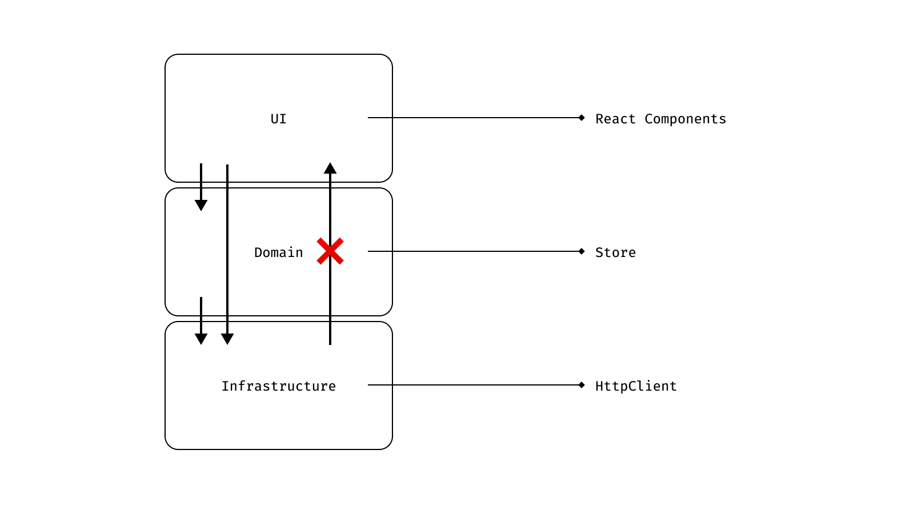
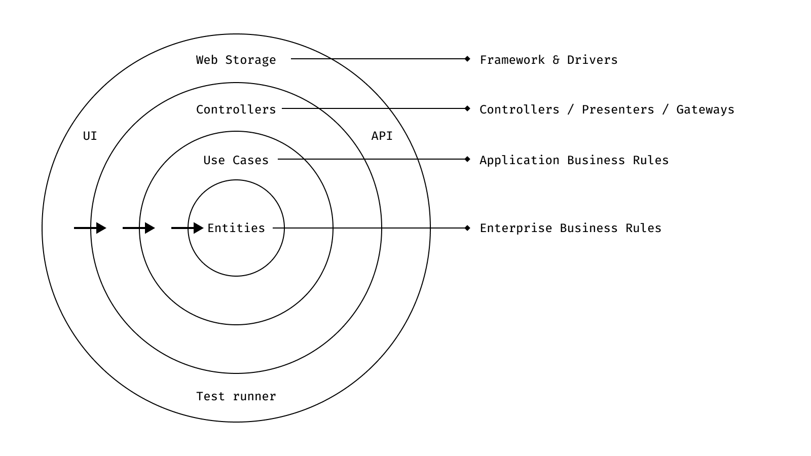
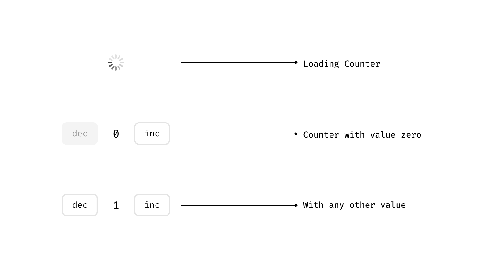

# On layered architecture 🍰

Layering is not a novel concept. It's been around in the industry for more than a couple of years (some of you reading this document are probably younger than layering) and it's one of the first architectural styles created. In short, layering is nothing more than dividing the concerns of your application into different layers, like in a cake, where the upper layers can talk to the bottom layers but no the other way around.

Layers interact through facades, so as long as the public APIs are honored, a layer doesn't have to know anything about internal implementation details of other layers.

Let's take a look at the following diagram:



Layered architecture, a diagram.

The most typical layered architecture has three layers: *UI*, *Domain* and *Infrastructure*. Our systems can have as many layers as needed, it doesn't have to be just 3. It's just that this is the most typical one.

Translating this into a React application, what we would do is have our view components in the top layer. Then our state management solution would go in the layer below. Last but not least we would have an infrastructure layer for talking to external resources, like our backend, a firebase database, pusher, local storage, and any other external source of information.

For a small application this is good enough, and it's probably how we've been writing React applications for a long time. But as applications grow, these layers keep getting fatter and they start doing too much, which makes them harder to reason about.

Before jumping into that mumbo jumbo, let's talk real quick about the benefits of layering and why we want to explore implementing a layered architecture.

### Ease of reasoning

Divide and conquer: the best way of solving a big problem is splitting it into smaller problems that are easier to solve. We can reason about a layer independently without worrying about the implementation of other layers.

### Substitution

Layers can be easily substituted with alternative implementations. It's not like we're switching our http library everyday, but when the time comes, the change is self contained within a layer and it should never leak outside the layer's boundaries. Refactoring becomes easier and less intrusive.

### Evolution

Architectures that scale must have the capacity of evolving as software matures and requirements change. Although we like to do some design upfront, there are things that will only show up after development starts. When using layers, we can delay decisions about implementation details until we have enough information to make a sensible choice.

### Decoupling

Dependencies between layers are controlled since they're one directional. Aiming for low coupling (while maintaining high cohesion, or [colocation](https://kentcdodds.com/blog/colocation)) is a nice way to avoid our application becoming a big ball of mud.

### Testability

Having a layered architecture allows testing each component in isolation easy. Although this is nice, in my opinion it is not the greatest benefit in terms of testability. For me the greatest benefit of layered architectures is that it’s easier to write tests while working on the code. Since each layer should have a well defined responsibility, it's easier to think about what's worth testing during implementation.

All of the things mentioned above help us to write code that's easier to maintain. A maintainable codebase makes us more productive as we spend less time fighting against technical debt and more time working on new features. It also reduces risk when introducing changes. Last but not least, it makes our code easier to test, which ultimately gives us more confidence during development and refactoring.

Now that we know the benefits of layering and layered architectures, let us talk about what type of layered architecture we are proposing for a large React app.

# CLEAN architecture

CLEAN architecture is a type of layered architecture composed by various ideas from other layered architectures, like Onion architecture, Hexagonal architecture and Ports and Adapters architecture among others.

The core idea behind CLEAN is putting the business and the business entities at the center of a software system, and each other layer wrapping the entities. Outer layers are less specific to the business whilst inner layers are all about the business.

We'll describe briefly what each layer does in CLEAN architecture, in order to understand how we can leverage some of these concepts in our React applications.



CLEAN architecture, a diagram 

### Entities

At the center of the diagram we have entities. In classical CLEAN architecture, entities are a mean  of containing state related to business rules. Entities should be plain data structures and have no knowledge of our application framework or UI framework.

For a frontend application, this is where we have the logic related to the entities of our system. We commonly put these entities into a state management library. We'll discuss about this with more details later on.

### **Use Cases**

Use cases are close to what user stories are in agile terminology. This is where the application business rules live. A use case should represent something a user wants to achieve. Use cases should have all the code to make that happen in a way that makes sense to the application. Notice that use cases can only depend on inner layers, so in order for stuff to happen inside a use case (let's say make an http request) we have to inject dependencies into our use case and apply inversion of control.

### **Controllers / Presenters / Gateways**

This layer contains framework code that implements the use cases. Typically the UI layer would call the methods exposed by the controllers or presenters.

### **Framework & Drivers**

The outermost layer is where all the IO operations are contained. User input, http connections, reading from a web storage, etc. This is where our UI framework lives.

It is worth noting that as any other layered architecture, we can add as many layers as our system needs. With that being said, let's see how these concepts match with what we usually do with React to implement this architecture on a toy application.

## A really convoluted counter application

We'll talk about each concept on CLEAN architecture through a ~~really convoluted~~ simple counter application. Our application will look something like this:



A ~~really convoluted~~ simple counter application

Let's describe some of the requirements of our application.

- The initial value should come from a remote data source
- The counter can't be decremented when the counter value is 0
- We should persist the counter value back to our remote data source

We'll talk about each layer for our counter application:

### **Entities**

In the center of the universe we have our domain entities. In this case we'll define a `Counter` interface with nothing more than a value property. This could also be just a plain type alias for number (`type Counter = number;`).

It's important to say that this is how we're going to understand a `Counter` entity in the rest of our application, so this definition is kind of the "source of truth" in terms of what a counter is.

```tsx
// domain/counterEntity.ts
export interface Counter {
	value: number;
}
```

Although we could use a class for representing the data model, an `interface` works just fine.

### **Domain model**

According to [Martin Fowler](https://martinfowler.com/eaaCatalog/domainModel.html):

> An object model of the domain that incorporates both behavior and data.
> 

Inside our domain model we can define operations over our entities. In this case a simple increment and decrement functions will do.

Notice that the business rule that the counter value can never go under zero is defined here, right next to the entity definition.

```tsx
// domain/counterModel.ts
import type { Counter } from "./counterEntity";

const create = (count: Counter["value"]) => ({ value: count });
const decrement = (counter: Counter) => ({
  value: Math.max(counter.value - 1, 0)
});
const increment = (counter: Counter) => ({ value: counter.value + 1 });

export { create, decrement, increment };
```

We could put the entity interface and the domain model in the same file and it would be completely fine.

### **Data Store (a.k.a repository)**

This layer is for what we typically think of as state management. However, here we only define the shape of our data access layer, not the implementation. For this we can use an interface.

```tsx
// domain/counterStore.ts
import type { Counter } from "./counterEntity";

interface CounterStore {
  // State
  counter: Counter | undefined;
  isLoading: boolean;
  isUpdating: boolean;

  // Actions
  loadInitialCounter(): Promise<Counter>;
  setCounter(counter: Counter): void;
  updateCounter(counter: Counter): Promise<Counter | undefined>;
}

export type { CounterStore };
```

### **Use cases**

As mentioned previously, use cases can be defined as user stories, or things a user (or any other external system) can do with our system.

There are 3 use cases for our application

- Get the counter initial value from a data source
- Increment the counter value
- Decrement the counter value

Notice that updating the counter value in the remote data source is not a use case. That is a side effect of incrementing or decrementing the counter. For this layer it doesn't even matter that the data source is remote.

**Get counter use case**

```tsx
// useCases/getCounterUseCase.ts
import type { CounterStore } from "../domain/counterStore";

type GetCounterStore = Pick<CounterStore, "loadInitialCounter">;

const getCounterUseCase = (store: GetCounterStore) => {
  store.loadInitialCounter();
};

export { getCounterUseCase };
```

For this particular case we've defined an interface `Store` for the data store (a.k.a repository) that only needs to have a `getCounter` method. Our real `Store` implementation will probably have many more methods, but this is the only thing we care about in this layer.

**Increment counter use case**

```tsx
// useCases/incrementCounterUseCase.ts
import { updateCounterUseCase } from "./updateCounterUseCase";
import type { UpdateCounterStore } from "./updateCounterUseCase";
import { increment } from "../domain/counterModel";

const incrementCounterUseCase = (store: UpdateCounterStore) => {
  return updateCounterUseCase(store, increment);
};

export { incrementCounterUseCase };
```

**Decrement counter use case**

```tsx
// useCases/decrementCounterUseCase.ts
import { updateCounterUseCase } from "./updateCounterUseCase";
import type { UpdateCounterStore } from "./updateCounterUseCase";
import { decrement } from "../domain/counterModel";

const decrementCounterUseCase = (store: UpdateCounterStore) => {
  return updateCounterUseCase(store, decrement);
};

export { decrementCounterUseCase };
```

**Update counter use case**

The two previous use cases use this `updateCounterUseCase` to update the counter value under the hood. As you can see use cases can be composed.

```tsx
// useCases/updateCounterUseCase.ts
import debounce from "lodash.debounce";

import type { Counter } from "../domain/counterEntity";
import type { CounterStore } from "../domain/counterStore";

type UpdateCounterStore = Pick<
  CounterStore,
  "counter" | "updateCounter" | "setCounter"
>;

const debouncedTask = debounce((task) => Promise.resolve(task()), 500);

const updateCounterUseCase = (
  store: UpdateCounterStore,
  updateBy: (counter: Counter) => Counter
) => {
  const updatedCounter = store.counter
    ? updateBy(store.counter)
    : store.counter;

  if (updatedCounter) {
    store.setCounter(updatedCounter);

    return debouncedTask(() => store.updateCounter(updatedCounter));
  }
};

export { updateCounterUseCase };
export type { UpdateCounterStore };
```

Notice how we debounce the call to `store.updateCounter` here, instead of debouncing the button click. This might feel counterintuitive at first, but now the application logic is contained in a single place rather than spread between too many layers.

### **Controllers / Presenters / Gateways**

As you probably noticed, we haven't written anything specific to React so far: it's only been plain ole TypeScript. This is the first layer where we're going to use React code.

The role of this layer is to encapsulate *use cases* so they can be called from the UI. For this we can use plain react hooks.

We'll use a ViewModel kind of pattern here (we'll elaborate more deeply on the role of this component later on):

```tsx
// controller/counterViewModel.ts
import React from "react";

import type { CounterStore } from "../domain/counterStore";
import { getCounterUseCase } from "../useCases/getCounterUseCase";
import { incrementCounterUseCase } from "../useCases/incrementCounterUseCase";
import { decrementCounterUseCase } from "../useCases/decrementCounterUseCase";

function useCounterViewModel(store: CounterStore) {
  const getCounter = React.useCallback(
    function () {
      getCounterUseCase({
        loadInitialCounter: store.loadInitialCounter
      });
    },
    [store.loadInitialCounter]
  );

  const incrementCounter = React.useCallback(
    function () {
      incrementCounterUseCase({
        counter: store.counter,
        updateCounter: store.updateCounter,
        setCounter: store.setCounter
      });
    },
    [store.counter, store.updateCounter, store.setCounter]
  );

  const decrementCounter = React.useCallback(
    function () {
      decrementCounterUseCase({
        counter: store.counter,
        updateCounter: store.updateCounter,
        setCounter: store.setCounter
      });
    },
    [store.counter, store.updateCounter, store.setCounter]
  );

  return {
    count: store.counter?.value,
    shouldShowSpinner: typeof store.counter === "undefined" || store.isLoading,
    shouldDisableButton: store.counter?.value === 0,
    getCounter,
    incrementCounter,
    decrementCounter
  };
}

export { useCounterViewModel };
```

The view model not only binds the use cases to framework specific functions, but it also formats the data to semantic variables, so the presentation logic is contained in a single place, rather than scattered throughout the whole view.

### **Frameworks & Drivers**

Ok so this is the outermost layer and here we can have all our specific library code, for this particular example it would mean:

- React components
- A state management library store implementation
- A counter API service so we can persist the data to the data source
- An HTTP client for talking to the remote data source
- Internationalization
- and much more

We'll start creating the API service:

**Counter API Service**

```tsx
// counterAPIService.ts
import httpClient from './httpClient'; // this could be an axios instance, I'm skipping this because is not relevant
import type { Counter } from './counterEntity';
import { create } from './counterModel';

const BASE_URL = 'counter';

function getCounter(): Promise<Counter> {
  return httpClient.get<number>(BASE_URL).then(res => create(res.data));
}

function updateCounter(counter: Counter): Promise<Counter> {
  return httpClient.put<number>(BASE_URL, { count: counter.value }).then(res => create(res.data));
}

export { getCounter, updateCounter };
```

**Data Store Implementation (a.k.a. repository implementation)**

The beauty about layered architecture is that we don't care about how the hell layers are implemented internally. For the `CounterStoreImplementation` we could use anything: `mobx`, `redux`, `zustand`, `recoil`, a simple React component, whatever, it doesn't matter.

We'll use `redux` here for good measure, just to demonstrate that the implementation details don't leak into the other layers:

```tsx
// data/counterActionTypes.ts
export const SET_COUNTER = "SET_COUNTER";
export const GET_COUNTER = "GET_COUNTER";
export const GET_COUNTER_SUCCESS = "GET_COUNTER_SUCCESS";
export const UPDATE_COUNTER = "UPDATE_COUNTER";
export const UPDATE_COUNTER_SUCCESS = "UPDATE_COUNTER_SUCCESS";
```

---

```tsx
// data/counterActions.ts
import type { Counter } from "../domain/counterEntity";
import { getCounter, updateCounter } from "./counterService";
import * as actionTypes from "./counterActionTypes";

const setCounterAction = (counter: Counter) => (dispatch) =>
  dispatch({ type: actionTypes.SET_COUNTER, counter });

const getCounterAction = () => (dispatch) => {
  dispatch({ type: actionTypes.GET_COUNTER });

  return getCounter().then((counter) => {
    dispatch({ type: actionTypes.GET_COUNTER_SUCCESS, counter });

    return counter;
  });
};

const updateCounterAction = (counter: Counter) => (dispatch) => {
  dispatch({ type: actionTypes.UPDATE_COUNTER });

  return updateCounter(counter).then((counter) => {
    dispatch({ type: actionTypes.UPDATE_COUNTER_SUCCESS });

    return counter;
  });
};

export { setCounterAction, getCounterAction, updateCounterAction };
```

---

```tsx
// counterReducer.ts
import type { CounterStore } from "../domain/counterStore";
import * as actionTypes from "./counterActionTypes";

type CounterStoreState = Omit<CounterStore, "update" | "getCounters">;

const INITIAL_STATE: CounterStoreState = {
  counter: undefined,
  isLoading: false,
  isUpdating: false
};

const counterReducer = (state: CounterStoreState = INITIAL_STATE, action) => {
  switch (action.type) {
    case actionTypes.SET_COUNTER:
      return { ...state, counter: action.counter };
    case actionTypes.GET_COUNTER:
      return { ...state, isLoading: true };
    case actionTypes.GET_COUNTER_SUCCESS:
      return { ...state, isLoading: false, counter: action.counter };
    case actionTypes.UPDATE_COUNTER:
      return { ...state, isUpdating: true };
    case actionTypes.UPDATE_COUNTER_SUCCESS:
      return { ...state, isUpdating: false };
    default:
      return state;
  }
};

export { counterReducer };
export type { CounterStoreState };
```

With all of our typical redux code in place, only now we can create a counter store implementation for the `CounterStore` interface:

```tsx
// data/counterStoreImplementation.ts
import React from "react";
import { useDispatch, useSelector } from "react-redux";

import type { AppRootState } from "../../main/data/appStoreImplementation";
import type { CounterStore } from "../domain/counterStore";
import type { Counter } from "../domain/counterEntity";

import type { CounterStoreState } from "./counterReducer";
import {
  getCounterAction,
  setCounterAction,
  updateCounterAction
} from "./counterActions";

const counterSelector = (state: AppRootState) => state.counter;

const useCounterStoreImplementation = (): CounterStore => {
  const { counter, isLoading, isUpdating } = useSelector<
    AppRootState,
    CounterStoreState
  >(counterSelector);
  const dispatch = useDispatch();

  const setCounter = React.useCallback(
    (counter: Counter) => setCounterAction(counter)(dispatch),
    [dispatch]
  );

  const loadInitialCounter = React.useCallback(
    () => getCounterAction()(dispatch),
    [dispatch]
  );

  const updateCounter = React.useCallback(
    (counter: Counter) => updateCounterAction(counter)(dispatch),
    [dispatch]
  );

  return {
    counter,
    isLoading,
    isUpdating,
    setCounter,
    loadInitialCounter,
    updateCounter
  };
};

export { useCounterStoreImplementation };
```

**View**

The last layer we'll show case here is the UI or View layer. This is the integration point for all of our components:

```tsx
// view/AppView.tsx
import React from "react";

import Button from "../../shared/ui/Button";
import Count from "../../shared/ui/Count";
import Spinner from "../../shared/ui/Spinner";

import { useCounterViewModel } from "../controller/counterViewModel";
import { useCounterStoreImplementation } from "../data/counterStoreImplementation";

const CounterView = () => {
  const store = useCounterStoreImplementation();
  const {
    count,
    shouldDisableButton,
    shouldShowSpinner,
    getCounter,
    incrementCounter,
    decrementCounter
  } = useCounterViewModel(store);

  React.useEffect(() => {
    getCounter();
  }, [getCounter]);

  return (
    <div className="App">
      {shouldShowSpinner ? (
        <Spinner />
      ) : (
        <>
          <Button onClick={decrementCounter} disabled={shouldDisableButton}>
            dec
          </Button>
          <Count>{count}</Count>
          <Button onClick={incrementCounter}>inc</Button>
        </>
      )}
    </div>
  );
};

export default CounterView;
```

## References

- Martin Fowler - Catalog of Patterns of Enterprise Application Architecture
[https://martinfowler.com/eaaCatalog/domainModel.html](https://martinfowler.com/eaaCatalog/domainModel.html)
- Denis Brandi - Why you need use cases interactors
[https://proandroiddev.com/why-you-need-use-cases-interactors-142e8a6fe576](https://proandroiddev.com/why-you-need-use-cases-interactors-142e8a6fe576)
- Bob Martin - The Clean Architecture
[https://blog.cleancoder.com/uncle-bob/2012/08/13/the-clean-architecture.html](https://blog.cleancoder.com/uncle-bob/2012/08/13/the-clean-architecture.html)
- Daniel Mackay - Clean Architecture, an introduction
[https://www.dandoescode.com/blog/clean-architecture-an-introduction/](https://www.dandoescode.com/blog/clean-architecture-an-introduction/)
- CodingWithMitch - 2 Key Concepts of Clean Architecture
[https://www.youtube.com/watch?v=NyJLw3sc17M](https://www.youtube.com/watch?v=NyJLw3sc17M)
- Frank Bos and Fouad Astitou - Fuck CLEAN Architecture
[https://www.youtube.com/watch?v=zkmcy9WQqUE](https://www.youtube.com/watch?v=zkmcy9WQqUE)
- Ian Cooper, The Clean Architecture
[https://www.youtube.com/watch?v=SxJPQ5qXisw](https://www.youtube.com/watch?v=SxJPQ5qXisw)